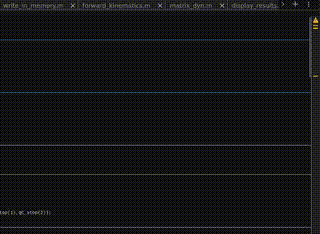

# Robotics Project: 2-DoF Manipulator Control

## Project Overview

This project involves the development and implementation of control algorithms for a 2-DoF (two-degree-of-freedom) robotic manipulator. The main goals are to achieve accurate trajectory tracking and efficient control of joint movements using PD (Proportional-Derivative) and decentralized control strategies.

## Methodology

### 1. Trajectory Planning

Trajectory planning was implemented to define the desired motion of the robot from the initial to the final state. We used a trapezoidal profile to generate reference positions, velocities, and accelerations for the joints.

### 2. Control Design

**Decentralized PD Control:**
- Developed separate PD controllers for each joint of the manipulator.
- Used proportional and derivative gains to control the position and velocity of each joint independently.

**Mathematical Formulation:**
The control torque \(\tau_j\) for each joint is calculated as:
\[ \tau_j = G_j + K_{p,j} (q_{ref,j} - q_j) + K_{d,j} (\dot{q}_{ref,j} - \dot{q}_j) \]

where \(G_j\) is the gravity compensation term, \(K_{p,j}\) and \(K_{d,j}\) are proportional and derivative gains, and \(q_j\) and \(\dot{q}_j\) are the joint position and velocity, respectively.

### 3. Simulation and Results

The main simulation loop involves:
- Applying external forces at specific time intervals.
- Calculating joint torques based on the control law.
- Integrating the dynamics using ODE solvers.
- Updating and visualizing the joint positions and velocities.

### 4. Functions

**Function `int_2DoF`**
- Defines the model of the 2-DoF robot manipulator, computing the derivatives of joint positions and velocities.

**Function `write_in_memory`**
- Stores simulation results including joint positions, velocities, and torques for later analysis.

## Results
  

## Conclusion

This project demonstrates the implementation of decentralized control for a 2-DoF robotic manipulator. The PD controllers effectively track the desired trajectories, and the results show the system's performance in terms of joint positions, velocities, and torques.

## Future Work

- Explore more advanced control strategies, such as PID or adaptive control.
- Improve trajectory planning to handle more complex motion profiles.
- Integrate real-time feedback and system identification for enhanced performance.

## References

- Robotics textbooks and research papers on PD control and trajectory planning.
- MATLAB documentation for ODE solvers and visualization tools.

## License

This project is licensed under the MIT License - see the [LICENSE](LICENSE) file for details.

